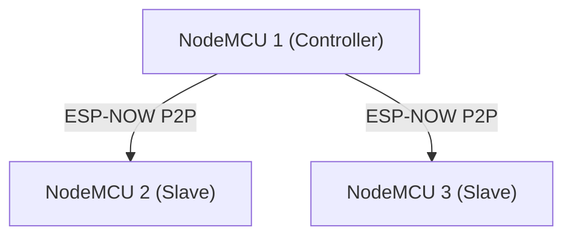
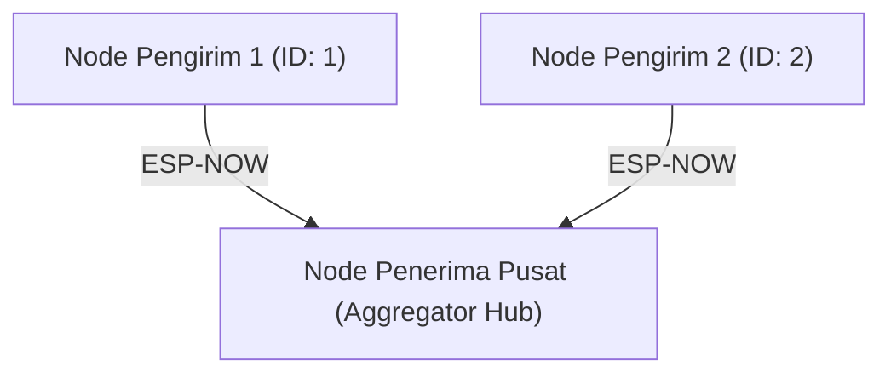
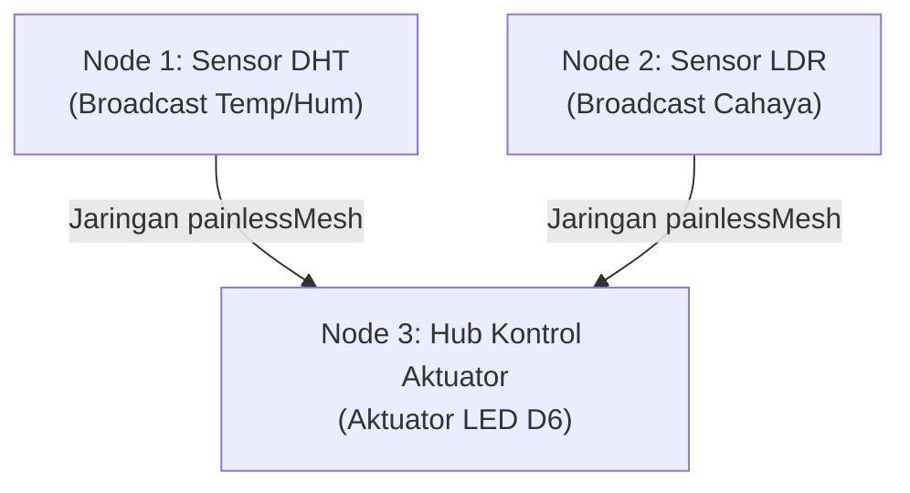

# **Modul 5: Topologi Jaringan Terdesentralisasi (ESP-NOW dan Mesh)**

## **5.1 Pengantar**

Pada Modul 3 dan Modul 4, kita telah berhasil menghubungkan NodeMCU ke jaringan nirkabel lokal menggunakan protokol Wi-Fi standar (HTTP dan WebSockets). Namun, seluruh komunikasi tersebut bergantung pada keberadaan titik akses pusat (*Access Point* atau *Router*) sebagai perantara. Pada skenario penerapan IoT di area terbuka yang luas—seperti perkebunan cerdas (*smart agriculture*), pemantauan hutan, atau area pergudangan logistik—keberadaan infrastruktur *router* sering kali tidak tersedia, memerlukan biaya instalasi yang tinggi, dan menjadi titik kegagalan tunggal (*single point of failure*).

Untuk mengatasi kendala tersebut, modul ini memperkenalkan paradigma **jaringan terdesentralisasi (*Decentralized / Peer-to-Peer*)** menggunakan dua teknologi utama pada ekosistem ESP8266:
1. **ESP-NOW:** Protokol komunikasi nirkabel berkecepatan tinggi tanpa *handshake* yang sangat hemat energi (*battery-friendly*).
2. **painlessMesh:** Jaringan nirkabel *Ad-Hoc Multi-Hop* otonom (*Self-Organizing & Self-Healing*) yang memampukan node saling merelai data melintasi jarak jauh tanpa konfigurasi alamat MAC statis maupun ketergantungan pada *router*.

## **5.2 Tujuan Pembelajaran**

* Mahasiswa mampu menjelaskan perbedaan fundamental antara arsitektur jaringan berbasis infrastruktur (*Access Point/Router*) dan jaringan terdesentralisasi (*Peer-to-Peer*).
* Mahasiswa mampu membaca dan mendokumentasikan alamat fisik (*MAC Address*) dari antarmuka Wi-Fi NodeMCU ESP8266.
* Mahasiswa mampu mengonfigurasi dan memprogram komunikasi data searah dengan topologi *One-to-Many* (Satu Pengirim ke Banyak Penerima) berbasis protokol ESP-NOW.
* Mahasiswa mampu mengonfigurasi dan memprogram agregasi data dengan topologi *Many-to-One* (Banyak Sensor ke Satu Penerima Pusat) berbasis protokol ESP-NOW.
* Mahasiswa mampu membangun jaringan *Self-Organizing Ad-Hoc Mesh* menggunakan pustaka `painlessMesh` tanpa ketergantungan konfigurasi *MAC Address* statis.

## **5.3 Teori Dasar**

### **5.3.1 Jaringan Berbasis Infrastruktur vs Jaringan Terdesentralisasi**

Pada jaringan berbasis infrastruktur, setiap perangkat *Station* (STA) harus tersambung ke *Access Point* (AP) pusat. Jika dua node ingin bertukar data, paket harus melewati *router* terlebih dahulu.

Kelemahan arsitektur terpusat untuk perangkat IoT lapangan:
1. **Titik Kegagalan Tunggal (*Single Point of Failure*):** Jika daya router padam atau sinyalnya terganggu, seluruh komunikasi sensor terputus seketika.
2. **Konsumsi Daya & Latensi Tinggi:** Proses asosiasi Wi-Fi (pemberian SSID, autentikasi WPA2 4-way handshake, serta negosiasi alamat IP via DHCP) memakan waktu 2 hingga 10 detik, yang sangat menguras kapasitas baterai.
3. **Batas Jangkauan Radio Statis:** Perangkat hanya dapat berkomunikasi selama masih berada dalam lingkaran jangkauan radio pemancar *router*.

Sebagai solusinya, arsitektur **Peer-to-Peer (P2P)** dan **Mesh** membebaskan perangkat dari *router*, memungkinkan node berkomunikasi secara langsung satu sama lain atau membentuk rantai lompatan (*multi-hop relay*).

### **5.3.2 Protokol ESP-NOW**

**ESP-NOW** adalah protokol komunikasi nirkabel berbasis paket pendek (*short-packet*) tanpa koneksi (*connectionless*) yang dirancang khusus oleh Espressif Systems. Protokol ini beroperasi pada pita frekuensi 2.4 GHz menggunakan *Vendor-Specific Action Frame* pada lapisan MAC (Layer 2) standar IEEE 802.11, meniadakan *overhead* lapisan jaringan TCP/IP yang berat.

```text
+-------------------------------------------------------------+
|                     Aplikasi Sensor IoT                     |
+-------------------------------------------------------------+
|         ESP-NOW Layer (Transmisi Paket Maks. 250 Byte)      |
+-------------------------------------------------------------+
|         Vendor-Specific Action Frame (Layer 2 MAC)          |
+-------------------------------------------------------------+
|                       Physical RF 2.4 GHz                   |
+-------------------------------------------------------------+
```

**Karakteristik Utama ESP-NOW:**
* **Tanpa Handshake:** Transmisi data dapat langsung dieksekusi dalam hitungan milidetik ($< 5\ \text{ms}$) seketika mikrokontroler aktif dari mode *sleep*.
* **Pengalamatan Fisik Berbasis MAC:** Paket ditujukan langsung ke alamat perangkat keras (*MAC Address*) 48-bit milik penerima, bukan berbasis *IP Address*.
* **Batas Muatan (*Payload Limit*):** Ukuran maksimum paket data dalam satu kali transmisi adalah **250 byte**.
* **Efisiensi Daya Tinggi:** Sangat ideal dipadukan dengan mode tidur lelap (*Deep Sleep*) untuk perangkat sensor mandiri bertenaga baterai atau sel surya.
* **Peran Perangkat (*Roles*):**
  * `ESP_NOW_ROLE_CONTROLLER`: Node yang bertindak sebagai pemancar perintah/data.
  * `ESP_NOW_ROLE_SLAVE`: Node yang bertindak sebagai penerima pasif.
  * `ESP_NOW_ROLE_COMBO`: Node yang dapat bertindak sebagai pengirim sekaligus penerima secara dua arah.

### **5.3.3 Konsep Struktur Data (`struct`) dalam Transmisi Paket**

Transmisi paket ESP-NOW mengirimkan deretan bita memori mentah (*raw bytes*) melalui pointer data `(uint8_t *)`. Agar beragam tipe data (seperti bilangan bulat, desimal, teks, dan status sakelar) dapat dikirimkan secara ringkas dalam satu kesatuan, bahasa C++ menyediakan fitur `struct` (struktur):

$$\text{Total Ukuran Payload} = \sum \text{sizeof}(\text{tipe\_data}) \le 250\ \text{byte}$$

> **[PENTING!] Aturan Struktur Data:** Definisi nama, urutan variabel, dan tipe data di dalam blok `struct` pada perangkat **Pengirim** harus **identik persis** dengan `struct` pada perangkat **Penerima**. Ketidakcocokan urutan variabel akan menyebabkan data rusak (*memory corruption / garbage values*) saat fungsi `memcpy()` dieksekusi di sisi penerima.

### **5.3.4 Konsep Jaringan Ad-Hoc Mesh (`painlessMesh`)**

Pada ESP-NOW standar, node pengirim harus berada dalam jangkauan sinyal radio penerima secara langsung (*single hop*). Apabila jarak antar-node terhalang dinding tebal atau berada di luar jangkauan radio ($> 100\ \text{meter}$), transmisi paket akan gagal.

Jaringan **Mesh** memecahkan batasan tersebut dengan arsitektur **Ad-Hoc Multi-Hop**:
* **Peran Simultan:** Setiap node ESP8266 secara bersamaan memancarkan sinyal mini *Access Point* (*soft-AP*) sekaligus terhubung sebagai *Station* (STA) ke node tetangganya.
* **Mekanisme Relai (*Multi-Hop Relay*):** Node yang berjarak jauh dapat mengirimkan data ke node pusat dengan "meminjam" node perantara sebagai jembatan estafet (*repeater*).
* **Otonom & Tahan Gangguan (*Self-Organizing & Self-Healing*):** Jaringan secara otomatis membentuk topologi terbaik. Jika salah satu node perantara mati, rute paket secara dinamis dialihkan ke jalur alternatif tanpa intervensi pengguna.
* **Bebas Konfigurasi MAC:** Pengembang tidak perlu mencatat alamat MAC satu per satu; node cukup menyamakan nama pengenal jaringan (*Mesh Prefix*) dan kata sandi bersama (*Mesh Password*).

### **5.3.5 Perbandingan Komparatif: ESP-NOW vs painlessMesh**

| Karakteristik | ESP-NOW | painlessMesh |
| :--- | :--- | :--- |
| **Topologi Jaringan** | *Star* / *Point-to-Point* langsung | *Ad-Hoc Mesh* (*Multi-Hop Dynamic*) |
| **Ketergantungan Alamat** | Wajib mencatat *MAC Address* lawan secara statis | Tidak perlu MAC lawan (cukup *Prefix* & *Password*) |
| **Batas Jangkauan Radio** | Terbatas jangkauan langsung antena (1 hop) | Fleksibel melompat antar-node perantara (*multi-hop*) |
| **Latensi & Daya** | Sangat rendah ($< 5\ \text{ms}$), sangat hemat energi | Menengah (terdapat beban *overhead* rute & sinkronisasi) |
| **Kapasitas Payload** | Maksimal 250 byte per paket | Dinamis (terbatas alokasi RAM/Heap mikrokontroler) |
| **Dukungan Deep Sleep** | Sangat optimal | Kurang cocok (node harus selalu siaga merelai data) |

## **5.4 Persiapan Praktikum**

### **5.4.1 Kebutuhan Perangkat Keras**

*Praktikum ini dirancang sebagai tugas kolaboratif kelompok. Setiap kelompok minimal terdiri dari 2 orang mahasiswa (idealnya 3 orang), dengan masing-masing memegang 1 unit NodeMCU.*

Pastikan komponen berikut tersedia di meja kelompok Anda:
* *Board* NodeMCU ESP8266 (Minimal 2 unit, disarankan 3 unit)
* Kabel Micro-USB Data (1 per mahasiswa)
* *Breadboard* / *Project Board* (secukupnya)
* Sensor Suhu & Kelembapan DHT11 atau DHT22 (1 buah per board / mahasiswa)
* Sensor Cahaya LDR (1 buah)
* Resistor 10k Ohm (1 buah, pembagi tegangan LDR)
* LED 5mm (1 buah)
* Resistor 220 Ohm (1 buah, pembatas arus LED)
* Kabel *Jumper* (*Male-to-Male* dan *Male-to-Female* secukupnya)

### **5.4.2 Persiapan Perangkat Lunak & Pustaka**

Sebelum menjalankan praktikum jaringan *Mesh*, Anda wajib memasang pustaka pihak ketiga melalui Library Manager:

1. Pada Arduino IDE, buka menu **Sketch > Include Library > Manage Libraries...**
2. Ketikkan kata kunci **"painlessMesh"** di kolom pencarian (oleh *Coopdis, Scotty, etc.*).
3. Klik tombol **Install**. Saat muncul jendela konfirmasi dependensi pustaka tambahan, pastikan Anda mengeklik **"Install All"** agar pustaka pendukung berikut terpasang otomatis:
   * `ArduinoJson` (oleh Benoit Blanchon)
   * `TaskScheduler` (oleh Anatoli Arkhipenko)
   * `ESPAsyncTCP` (oleh dvarrel / me-no-dev)

---

## **5.5 Praktikum**

### **5.5.1 Praktikum 1: Identifikasi MAC Address Perangkat NodeMCU**

Sebelum membangun jaringan ESP-NOW, setiap anggota kelompok wajib membaca dan mencatat alamat fisik (*MAC Address*) dari masing-masing *board* NodeMCU.

**Langkah Kerja Pemrograman:**
1. Buat berkas baru (*New Sketch*) pada Arduino IDE.
2. Tuliskan kode program pembaca MAC Address berikut:

```cpp
#include <ESP8266WiFi.h>

void setup() {
  Serial.begin(115200);
  Serial.println();
  
  // Mengaktifkan mode Station agar MAC address antarmuka STA aktif
  WiFi.mode(WIFI_STA);
  WiFi.disconnect();
  
  Serial.print("ESP8266 MAC Address: ");
  Serial.println(WiFi.macAddress());
}

void loop() {
  // Tidak ada proses berulang
}
```

3. **Upload** program ke masing-masing *board* NodeMCU dalam kelompok Anda secara bergantian.
4. Buka **Serial Monitor** pada kecepatan **115200 baud**, lalu tekan tombol fisik **RST** pada *board*.
5. Catat 6 pasang digit heksadesimal yang muncul di layar (contoh: `BC:FF:4D:23:45:90`).
6. Beri label fisik pada *board* (misal: "Node 1", "Node 2", "Hub Pusat") beserta alamat MAC masing-masing agar tidak tertukar saat perakitan.

**Penjelasan Singkat Kode:**
* `WiFi.mode(WIFI_STA);` : Menyiapkan modul radio Wi-Fi internal ke dalam mode *Station* agar alamat perangkat keras (*Hardware MAC*) siap dialokasikan oleh SDK.
* `WiFi.disconnect();` : Memastikan mikrokontroler tidak mencoba melakukan proses penyambungan ke jaringan luar.
* `WiFi.macAddress();` : Mengambil string alamat fisik 48-bit bawaan pabrik yang bersifat unik secara global.

---

### **5.5.2 Praktikum 2: Komunikasi Nirkabel One-to-Many (ESP-NOW)**

Skenario: Satu unit NodeMCU bertindak sebagai **Controller / Sender**, menyiarkan paket data instruksi yang sama secara langsung ke dua unit NodeMCU lain yang bertindak sebagai **Slave / Receiver** tanpa perantara router.



#### **Langkah Kerja Pemrograman Sisi Pengirim (Controller):**
1. Masukkan alamat MAC milik Board Penerima 1 dan Board Penerima 2 ke dalam variabel `receiver1` dan `receiver2`.
2. Format tanda titik dua (`:`) diubah menjadi bilangan heksadesimal berawalan `0x` yang dipisahkan oleh tanda koma (contoh: `BC:FF:4D:23:45:90` $\rightarrow$ `{0xBC, 0xFF, 0x4D, 0x23, 0x45, 0x90}`).
3. Tuliskan kode berikut dan unggah ke **NodeMCU 1**:

```cpp
#include <ESP8266WiFi.h>
#include <espnow.h>

// GANTI dengan MAC Address Board Penerima 1 dan Board Penerima 2 Anda!
uint8_t receiver1[] = {0xFF, 0xFF, 0xFF, 0xFF, 0xFF, 0xFF};
uint8_t receiver2[] = {0xAA, 0xBB, 0xCC, 0xDD, 0xEE, 0xFF};

// Definisi struktur data paket instruksi
typedef struct struct_pesan {
  int perintahId;
  int nilaiParameter;
} struct_pesan;

struct_pesan paketKirim;

unsigned long previousMillis = 0;
const long interval = 2000; // Transmisi berkala setiap 2 detik

// Callback otomatis saat paket selesai dipancarkan radio
void OnDataSent(uint8_t *mac_addr, uint8_t sendStatus) {
  char macStr[18];
  snprintf(macStr, sizeof(macStr), "%02x:%02x:%02x:%02x:%02x:%02x",
           mac_addr[0], mac_addr[1], mac_addr[2], mac_addr[3], mac_addr[4], mac_addr[5]);
  
  Serial.print("Kirim paket ke: ");
  Serial.print(macStr);
  Serial.print(" | Status: ");
  if (sendStatus == 0) {
    Serial.println("Berhasil Diterima");
  } else {
    Serial.println("Gagal (Tidak Terjangkau)");
  }
}

void setup() {
  Serial.begin(115200);
  WiFi.mode(WIFI_STA);
  WiFi.disconnect();

  // Inisialisasi stack protokol ESP-NOW
  if (esp_now_init() != 0) {
    Serial.println("Gagal menginisialisasi ESP-NOW!");
    return;
  }

  // Tetapkan peran board sebagai Controller
  esp_now_set_self_role(ESP_NOW_ROLE_CONTROLLER);
  esp_now_register_send_cb(OnDataSent);

  // Daftarkan kedua board penerima ke tabel peer internal
  esp_now_add_peer(receiver1, ESP_NOW_ROLE_SLAVE, 1, NULL, 0);
  esp_now_add_peer(receiver2, ESP_NOW_ROLE_SLAVE, 1, NULL, 0);

  Serial.println("Controller ESP-NOW Siap!");
}

void loop() {
  unsigned long currentMillis = millis();
  if (currentMillis - previousMillis >= interval) {
    previousMillis = currentMillis;

    paketKirim.perintahId = 101;
    paketKirim.nilaiParameter = random(10, 100);

    // Argumen 0 berarti mengirimkan paket ke seluruh peer yang terdaftar
    esp_now_send(0, (uint8_t *) &paketKirim, sizeof(paketKirim));
  }
}
```

#### **Langkah Kerja Pemrograman Sisi Penerima (Slave):**
1. Unggah kode sketsa berikut ke **NodeMCU 2** dan **NodeMCU 3**.
2. Board penerima tidak perlu mengetahui alamat MAC milik Controller.

```cpp
#include <ESP8266WiFi.h>
#include <espnow.h>

// Struktur data penerima (wajib identik dengan sisi pengirim)
typedef struct struct_pesan {
  int perintahId;
  int nilaiParameter;
} struct_pesan;

struct_pesan paketTerima;

// Callback otomatis saat antena mendeteksi paket masuk
void OnDataRecv(uint8_t *mac_addr, uint8_t *incomingData, uint8_t len) {
  char macStr[18];
  snprintf(macStr, sizeof(macStr), "%02x:%02x:%02x:%02x:%02x:%02x",
           mac_addr[0], mac_addr[1], mac_addr[2], mac_addr[3], mac_addr[4], mac_addr[5]);

  // Salin buffer memori radio langsung ke struktur data variabel
  memcpy(&paketTerima, incomingData, sizeof(paketTerima));

  Serial.print("Paket masuk dari: ");
  Serial.println(macStr);
  Serial.print("Ukuran Data: ");
  Serial.print(len);
  Serial.println(" byte");
  Serial.print("Perintah ID: ");
  Serial.println(paketTerima.perintahId);
  Serial.print("Nilai Parameter: ");
  Serial.println(paketTerima.nilaiParameter);
  Serial.println("------------------------------------");
}

void setup() {
  Serial.begin(115200);
  WiFi.mode(WIFI_STA);
  WiFi.disconnect();

  if (esp_now_init() != 0) {
    Serial.println("Inisialisasi ESP-NOW Gagal!");
    return;
  }

  // Tetapkan peran board sebagai Slave
  esp_now_set_self_role(ESP_NOW_ROLE_SLAVE);
  esp_now_register_recv_cb(OnDataRecv);

  Serial.println("Receiver ESP-NOW Menunggu Paket...");
}

void loop() {
  // Loop kosong: penerimaan data sepenuhnya ditangani oleh interrupt callback
}
```

**Penjelasan Fungsi Khusus ESP-NOW:**
* `esp_now_init()` : Menginisialisasi *firmware stack* ESP-NOW pada chip ESP8266. Mengembalikan nilai `0` jika berhasil.
* `esp_now_set_self_role()` : Mengonfigurasi peran operasional NodeMCU (`ESP_NOW_ROLE_CONTROLLER` untuk pengirim, `ESP_NOW_ROLE_SLAVE` untuk penerima).
* `esp_now_register_send_cb(OnDataSent)` : Mendaftarkan fungsi *callback* yang akan dipanggil sesaat setelah gelombang radio memancarkan paket untuk memastikan laporan ACK diterima atau gagal.
* `esp_now_register_recv_cb(OnDataRecv)` : Mendaftarkan fungsi *callback* interupsi saat paket radio masuk ke antena penerima.
* `esp_now_add_peer(mac, role, channel, key, key_len)` : Mendaftarkan perangkat tujuan ke dalam tabel routing memori chip.
* `esp_now_send(0, data, size)` : Mengirimkan muatan data. Memasukkan angka `0` pada argumen pertama berarti paket dikirimkan berurutan ke **seluruh** *peer* yang terdaftar.
* `memcpy(&paketTerima, incomingData, sizeof(paketTerima))` : Menyalin deretan byte mentah dari penyangga memori (*buffer*) ke dalam variabel struktur `paketTerima`.

---

### **5.5.3 Praktikum 3: Pengumpulan Data Telemetri Many-to-One (ESP-NOW)**

Skenario: Dua node sensor di lapangan memancarkan data pengukuran masing-masing ke sebuah node konsentrator pusat (*Aggregator Hub / Base Station*).



#### **Langkah Kerja Pemrograman Sisi Node Pengirim:**
1. Masukkan alamat MAC milik **Board Penerima Pusat (Hub)** pada variabel `hubMacAddress`.
2. Pada Board Pengirim 1, atur: `#define BOARD_ID 1`.
3. Pada Board Pengirim 2, atur: `#define BOARD_ID 2`.
4. Unggah kode program berikut:

```cpp
#include <ESP8266WiFi.h>
#include <espnow.h>

// GANTI dengan MAC Address milik BOARD PENERIMA PUSAT (HUB)!
uint8_t hubMacAddress[] = {0xFF, 0xFF, 0xFF, 0xFF, 0xFF, 0xFF};

// Identitas unik node (Ubah angka ini untuk node yang berbeda!)
#define BOARD_ID 1

typedef struct struct_sensor {
  int id;
  float pembacaan1;
  float pembacaan2;
} struct_sensor;

struct_sensor dataKirim;

unsigned long prevTime = 0;
const unsigned long sendInterval = 3000; // Kirim data setiap 3 detik

void OnDataSent(uint8_t *mac_addr, uint8_t sendStatus) {
  Serial.print("Pengiriman Node #");
  Serial.print(BOARD_ID);
  Serial.println(sendStatus == 0 ? " -> Sukses Diterima Hub" : " -> Gagal Sampai");
}

void setup() {
  Serial.begin(115200);
  WiFi.mode(WIFI_STA);
  WiFi.disconnect();

  if (esp_now_init() != 0) {
    Serial.println("Inisialisasi ESP-NOW gagal");
    return;
  }

  esp_now_set_self_role(ESP_NOW_ROLE_CONTROLLER);
  esp_now_register_send_cb(OnDataSent);

  // Daftarkan hub penerima tunggal
  esp_now_add_peer(hubMacAddress, ESP_NOW_ROLE_SLAVE, 1, NULL, 0);
}

void loop() {
  unsigned long now = millis();
  if (now - prevTime >= sendInterval) {
    prevTime = now;

    dataKirim.id = BOARD_ID;
    dataKirim.pembacaan1 = random(250, 350) / 10.0; // Simulasi pembacaan suhu: 25.0 - 35.0 C
    dataKirim.pembacaan2 = random(400, 800) / 10.0; // Simulasi pembacaan kelembapan: 40.0 - 80.0 %

    esp_now_send(hubMacAddress, (uint8_t *) &dataKirim, sizeof(dataKirim));
  }
}
```

#### **Langkah Kerja Pemrograman Sisi Hub Konsentrator:**
Unggah kode sketsa berikut ke Board Penerima Pusat:

```cpp
#include <ESP8266WiFi.h>
#include <espnow.h>

typedef struct struct_sensor {
  int id;
  float pembacaan1;
  float pembacaan2;
} struct_sensor;

struct_sensor dataTerima;

// Array penampung data terakhir: Index 0 untuk Node 1, Index 1 untuk Node 2
struct_sensor records[2];

void OnDataRecv(uint8_t *mac_addr, uint8_t *incomingData, uint8_t len) {
  memcpy(&dataTerima, incomingData, sizeof(dataTerima));

  // Validasi ID agar tidak terjadi error index array out-of-bounds
  if (dataTerima.id >= 1 && dataTerima.id <= 2) {
    int index = dataTerima.id - 1;
    records[index].id = dataTerima.id;
    records[index].pembacaan1 = dataTerima.pembacaan1;
    records[index].pembacaan2 = dataTerima.pembacaan2;

    Serial.println("========================================");
    Serial.printf("DATA TERBARU DARI NODE #%d\n", dataTerima.id);
    Serial.printf("Parameter 1 : %.2f\n", records[index].pembacaan1);
    Serial.printf("Parameter 2 : %.2f\n", records[index].pembacaan2);
    Serial.println("========================================");
  }
}

void setup() {
  Serial.begin(115200);
  WiFi.mode(WIFI_STA);
  WiFi.disconnect();

  if (esp_now_init() != 0) {
    Serial.println("Gagal Inisialisasi ESP-NOW Hub!");
    return;
  }

  esp_now_set_self_role(ESP_NOW_ROLE_SLAVE);
  esp_now_register_recv_cb(OnDataRecv);

  Serial.println("Hub Konsentrator Siap Menerima Data Sensor...");
}

void loop() {
  // Loop bebas menangani tugas lain
}
```

---

### **5.5.4 Praktikum 4: Jaringan Sensor Ad-Hoc Multi-Hop (painlessMesh)**

Skenario: Seluruh board dalam kelompok dihubungkan ke sensor suhu & kelembapan riil (DHT11/DHT22) dan diintegrasikan ke dalam sebuah jaringan rantai otonom (*Mesh*). Setiap board secara berkala membaca sensor fisiknya, mengemas data telemetri ke dalam format **JSON**, dan menyiarkannya ke seluruh anggota jaringan tanpa perlu mengetahui alamat MAC masing-masing.

**Instruksi Perangkaian Perangkat Keras:**
* Pasang sensor **DHT11 / DHT22** pada masing-masing board NodeMCU:
  * Pin **VCC** sensor ke pin **3V3 (3.3V)** NodeMCU.
  * Pin **GND** sensor ke pin **GND** NodeMCU.
  * Pin **DATA / OUT** sensor ke pin **D4 (GPIO 2)** NodeMCU.

**Langkah Kerja Pemrograman:**
1. Unggah sketsa berikut ke **seluruh board** dalam kelompok Anda.
2. Berikan nama pengenal unik pada variabel `nodeName` di masing-masing board (misal: `"Node-1"`, `"Node-2"`, `"Node-3"`).
3. Jika menggunakan varian DHT22, ubah `#define DHTTYPE DHT11` menjadi `DHT22`.

```cpp
#include <painlessMesh.h>
#include <DHT.h>
#include <ArduinoJson.h>

#define MESH_PREFIX   "LabIoTMesh"       // Nama jaringan Mesh bersama
#define MESH_PASSWORD "iotmeshpassword"  // Kata sandi jaringan Mesh
#define MESH_PORT     5555               // Port komunikasi TCP Mesh

// Konfigurasi pin dan tipe sensor DHT
#define DHTPIN 2       // Pin D4 (GPIO 2)
#define DHTTYPE DHT11  // Ganti DHT22 jika menggunakan varian DHT22
DHT dht(DHTPIN, DHTTYPE);

// Identitas unik node untuk mempermudah identifikasi teks
const char* nodeName = "Node-1"; 

Scheduler userScheduler;
painlessMesh mesh;

// Prototipe fungsi pengiriman pesan berkala
void sendMessage();
Task taskSendMessage(TASK_SECOND * 3, TASK_FOREVER, &sendMessage);

void sendMessage() {
  // Pembacaan fisik data suhu dan kelembapan dari sensor DHT
  float suhu = dht.readTemperature();
  float kelembapan = dht.readHumidity();

  // Validasi pembacaan sensor
  if (isnan(suhu) || isnan(kelembapan)) {
    Serial.println("[DHT Error] Gagal membaca data dari sensor DHT!");
    return;
  }

  // Rangkai data telemetri ke dalam format JSON menggunakan ArduinoJson
  StaticJsonDocument<200> doc;
  doc["node"] = nodeName;
  doc["chipId"] = mesh.getNodeId();
  doc["suhu"] = suhu;
  doc["kelembapan"] = kelembapan;

  String msg;
  serializeJson(doc, msg);

  // Siarkan paket JSON ke seluruh jaringan mesh (multi-hop broadcast)
  mesh.sendBroadcast(msg);

  Serial.print("[KIRIM MESH] ");
  Serial.println(msg);
}

// Callback otomatis saat menerima pesan dari node manapun di jaringan mesh
void receivedCallback(uint32_t from, String &msg) {
  // Parsing muatan teks JSON yang diterima
  StaticJsonDocument<200> doc;
  DeserializationError error = deserializeJson(doc, msg);

  if (!error) {
    const char* sender = doc["node"];
    uint32_t chipId   = doc["chipId"];
    float suhu        = doc["suhu"];
    float kelembapan  = doc["kelembapan"];

    Serial.println("========================================");
    Serial.printf("[TERIMA DARI] %s (Node ID: %u | Chip ID: %u)\n", sender, from, chipId);
    Serial.printf("Suhu       : %.2f °C\n", suhu);
    Serial.printf("Kelembapan : %.2f %%\n", kelembapan);
    Serial.println("========================================");
  } else {
    Serial.printf("[TERIMA DATA MENTAH DARI %u]: %s\n", from, msg.c_str());
  }
}

// Callback otomatis saat ada perangkat baru bergabung ke mesh
void newConnectionCallback(uint32_t nodeId) {
  Serial.printf("--> Koneksi Baru Terdeteksi! Node ID: %u\n", nodeId);
}

// Callback otomatis saat topologi rantai mesh berubah (node keluar/masuk)
void changedConnectionCallback() {
  Serial.println("--> Topologi rantai mesh telah diperbarui");
}

void setup() {
  Serial.begin(115200);

  // Inisialisasi sensor DHT
  dht.begin();

  // Atur level log debugging (hanya tampilkan error dan status startup)
  mesh.setDebugMsgTypes(ERROR | STARTUP);

  // Inisialisasi jaringan mesh
  mesh.init(MESH_PREFIX, MESH_PASSWORD, &userScheduler, MESH_PORT);
  
  // Daftarkan event callback
  mesh.onReceive(&receivedCallback);
  mesh.onNewConnection(&newConnectionCallback);
  mesh.onChangedConnections(&changedConnectionCallback);

  // Jadwalkan tugas pengiriman data berkala menggunakan TaskScheduler
  userScheduler.addTask(taskSendMessage);
  taskSendMessage.enable();

  Serial.printf("Mesh Node [%s] Berjalan. Menunggu pembentukan topologi...\n", nodeName);
}

void loop() {
  // Wajib dipanggil rutin untuk memproses perutean paket dan sinkronisasi waktu
  mesh.update();
}
```

**Penjelasan Kode Khusus painlessMesh & Integrasi JSON:**
* `dht.readTemperature()` & `dht.readHumidity()` : Membaca nilai fisik suhu ($^\circ\text{C}$) dan kelembapan ($\%$) dari sensor DHT11/DHT22.
* `serializeJson(doc, msg)` : Mengubah struktur objek JSON menjadi deretan teks string ringkas siap siar.
* `deserializeJson(doc, msg)` : Membedah string teks JSON yang masuk kembali menjadi variabel numerik terpisah.
* `painlessMesh mesh;` : Menginisialisasi objek kontrol jaringan mesh yang menangani pembentukan soft-AP dan koneksi STA secara simultan di latar belakang.
* `mesh.getNodeId()` : Menghasilkan ID unik numerik berbasis MAC address bawaan chip ESP8266.
* `mesh.sendBroadcast(msg)` : Menyiarkan paket data teks ke seluruh node di dalam jaringan mesh. Paket akan diteruskan (*relayed*) otomatis oleh node perantara jika node target berada di luar jangkauan radio langsung.
* `TaskScheduler` (`userScheduler`) : Pengganti fungsi `delay()`. Di dalam jaringan mesh, penggunaan `delay()` dilarang keras karena akan membekukan tugas latar belakang perutean paket (*routing packet task*), yang dapat menyebabkan runtuhnya topologi mesh.
* `mesh.update()` : Menjalankan pemeliharaan koneksi, sinkronisasi jam internal mesh, dan pertukaran tabel rute secara kontinu di dalam siklus `loop()`.

---

## **5.6 Latihan**

Kerjakan latihan berbasis eksperimen, observasi serial monitor, dan modifikasi kode berikut untuk melengkapi laporan praktikum Anda:

*   **Latihan 1 (Eksperimen Deteksi ACK & Pemutusan Simpul - Praktikum 2):**
    Saat program Praktikum 2 (ESP-NOW One-to-Many) sedang berjalan normal dan mencetak status `"Berhasil Diterima"` (`sendStatus == 0`), lakukan eksperimen pemutusan simpul:
    1. Cabut kabel USB salah satu board Penerima (misal NodeMCU 2) dari sumber daya.
    2. Amati perubahan log pada Serial Monitor NodeMCU Controller pengirim! Apakah status pengiriman untuk MAC address board yang dicabut berganti menjadi `"Gagal (Tidak Terjangkau)"`?
    3. Jelaskan bagaimana protokol ESP-NOW pada lapisan *Layer 2 MAC* dapat mendeteksi kegagalan transmisi ke perangkat fisik tersebut meskipun sistem tidak menggunakan koneksi TCP!

*   **Latihan 2 (Eksperimen Dinamika Topologi & Self-Healing - Praktikum 4):**
    Jalankan jaringan `painlessMesh` pada Praktikum 4 hingga seluruh board saling terhubung dan mencetak pesan `--> Koneksi Baru Terdeteksi! Node ID: ...`.
    1. Tekan tombol fisik **RST** atau cabut daya salah satu board Node. Amati Serial Monitor pada board lainnya yang masih menyala. Berapa detik waktu yang dibutuhkan oleh *callback* `changedConnectionCallback()` untuk mendeteksi bahwa salah satu simpul telah keluar dari rantai mesh?
    2. Sambungkan kembali daya board tersebut. Berapa lama waktu yang dibutuhkan hingga node tersebut kembali terdaftar secara otonom ke dalam topologi mesh tanpa Anda mengonfigurasi ulang jaringan? Catat hasil observasi waktu tersebut!

*   **Latihan 3 (Eksperimen Modifikasi Filter Telemetri & Ambang Batas JSON - Praktikum 4):**
    Pada Praktikum 4, setiap node saat ini mencetak seluruh data telemetri dari semua pengirim tanpa penyaringan.
    1. Modifikasilah fungsi `receivedCallback` pada salah satu board agar bertindak sebagai **Pengawas Kondisi Suhu Kritis**: program **HANYA** mencetak kartu telemetri penuh ke Serial Monitor jika suhu yang dilaporkan oleh node tetangga bernilai **di atas 32.0 °C** (lakukan pengujian dengan mendekatkan jari hangat atau meniup sensor DHT pada node pengirim).
    2. Jika suhu bernilai normal ($\le 32.0\ ^\circ\text{C}$), program cukup mencetak status singkat satu baris: `[NORMAL] Telemetri dari Node <chipId> aman`.
    3. Tuliskan blok fungsi `receivedCallback(uint32_t from, String &msg)` hasil modifikasi Anda!

---

## **5.7 Tugas: Sistem Telemetri & Otomasi Terdistribusi Berbasis painlessMesh**

Kembangkan jaringan mesh pada Praktikum 4 menjadi sistem *monitoring* lingkungan dan kendali otomasi terdistribusi tanpa perantara router. Setiap kelompok membagi peran perangkat sebagai berikut:



*   **Tujuan:** Menguasai transmisi paket JSON terdistribusi melintasi jaringan *Ad-Hoc Mesh Multi-Hop* dan mengevaluasi *rule engine* otomasi aktuator LED di node konsentrator.
*   **Tingkat Kesulitan:** Lanjut (Kolaboratif Kelompok)
*   **Instruksi Perangkaian:**
    1. **Node 1 (Stasiun Lingkungan):** Hubungkan pin DATA sensor **DHT11/DHT22** ke pin **D4 (GPIO 2)** NodeMCU 1 (VCC ke 3V3, GND ke GND).
    2. **Node 2 (Stasiun Cahaya):** Rangkai sensor **LDR** dan **Resistor 10k Ohm** sebagai pembagi tegangan ke pin **A0** NodeMCU 2.
    3. **Node 3 (Hub Kontrol Aktuator):**
       - Hubungkan kaki Anoda (kaki panjang) **LED** ke pin **D6 (GPIO 12)** NodeMCU 3.
       - Hubungkan kaki Katoda (kaki pendek) LED ke salah satu kaki **Resistor 220 Ohm**, lalu hubungkan kaki resistor lainnya ke jalur **GND** *(rangkaian LED aktif-HIGH seperti pada Modul 3 dan Modul 4)*.

*   **Instruksi Pemrograman (Front-End & Back-End Mesh):**
    1. **Node 1 (Sensor DHT):**
       - Modifikasi fungsi `sendMessage()` agar membaca suhu dan kelembapan riil menggunakan pustaka `DHT.h` setiap 3 detik.
       - Kemas data ke dalam format string JSON ringkas dan siarkan via mesh:
         ```json
         {"tipe":"suhu_node","suhu":29.4,"kelembapan":65.0}
         ```
    2. **Node 2 (Sensor LDR):**
       - Modifikasi fungsi `sendMessage()` agar membaca nilai ADC analog LDR setiap 3 detik.
       - Kemas data ke dalam format string JSON ringkas dan siarkan via mesh:
         ```json
         {"tipe":"cahaya_node","adc":420}
         ```
    3. **Node 3 (Hub Aktuator Cerdas):**
       - Nonaktifkan `taskSendMessage` pada Node 3 (node ini bertindak pasif sebagai penerima dan pengambil keputusan).
       - Pada fungsi `receivedCallback(uint32_t from, String &msg)`:
         - Gunakan pustaka `ArduinoJson` (`JsonDocument` / `StaticJsonDocument<200>`) untuk membedah string JSON masuk.
         - Evaluasi kondisi *Rule Engine*:
           - **JIKA** data suhu dari Node 1 bernilai **di atas 31.0 Celcius** **ATAU** nilai ADC cahaya dari Node 2 bernilai **di bawah 300** (kondisi gelap), **nyalakan LED** (`digitalWrite(ledPin, HIGH)`).
           - Jika kedua parameter kembali ke kondisi normal, **matikan LED** (`digitalWrite(ledPin, LOW)`).
    4. **Eksperimen Ketahanan Jaringan (*Multi-Hop* dan *Self-Healing*):**
       - Jauhkan Node 1 dan Node 3 hingga berada di luar jangkauan radio langsung masing-masing.
       - Tempatkan Node 2 di posisi tengah antara Node 1 dan Node 3.
       - Amati pada Serial Monitor apakah paket telemetri dari Node 1 tetap dapat diterima oleh Node 3 melalui relai perantara (*multi-hop relay*) Node 2.
       - Matikan daya Node 2 (simulasi node putus/gagal), lalu amati perubahan status pada Serial Monitor Node 3 melalui *callback* `changedConnectionCallback()`.

*   **Kriteria Keberhasilan:**
    - Ketiga node berhasil membentuk jaringan rantai mesh otonom tanpa menggunakan router Wi-Fi eksternal.
    - Data sensor riil dari Node 1 dan Node 2 berhasil diterima dan di-*parsing* dengan benar oleh Node 3 menggunakan format JSON.
    - Logika *Rule Engine* pada Node 3 berhasil memicu aktuator LED fisik sesuai kondisi ambang batas (*threshold*).
    - Mekanisme *Multi-Hop Relay* dan *Self-Healing* teramati dengan jelas melalui log Serial Monitor.

> **[PENTING!]**
> **Instruksi Pengumpulan Tugas Praktikum**
> Seluruh pengerjaan praktikum dan tugas (meliputi *source code* berformat `.ino`, dokumentasi foto/video sirkuit yang berhasil, tangkapan layar *Serial Monitor*, serta laporan praktikum tertulis .PDF) harus dikumpulkan dengan cara melakukan **commit dan push ke repositori GitHub pribadi Anda masing-masing**.
> 
> Tautkan/kumpulkan *URL repositori GitHub* Anda pada sistem manajemen pembelajaran (LMS) kampus sebagai bukti penyelesaian praktikum ini.

---

## **5.8 Rangkuman**

Pada Modul 5, kita telah memperluas wawasan arsitektur IoT ke tingkat industri dengan mengeliminasi ketergantungan pada titik akses terpusat (*Wi-Fi Router*). Melalui protokol **ESP-NOW**, kita membuktikan bahwa transmisi data sensor nirkabel dapat dilakukan secara instan ($< 5\ \text{ms}$) dengan konsumsi daya yang sangat minim, menjadikannya pilihan utama untuk simpul sensor mandiri bertenaga baterai yang beroperasi dengan siklus tidur lelap (*Deep Sleep*). Di sisi lain, adopsi jaringan **painlessMesh** menghadirkan kapabilitas *Ad-Hoc Multi-Hop* otonom, di mana sekumpulan mikrokontroler murah dapat saling bahu-membahu merelai paket data melintasi area yang luas dan secara otomatis memulihkan diri (*self-healing*) saat terjadi simpul yang gagal. Penguasaan kombinasi antara protokol P2P berkecepatan tinggi dan jaringan *Mesh* otonom ini menjadi bekal fundamental dalam merancang infrastruktur IoT skala lapangan yang tangguh, adaptif, dan berdaya tahan tinggi.