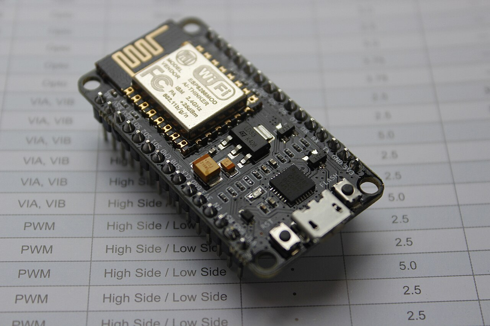
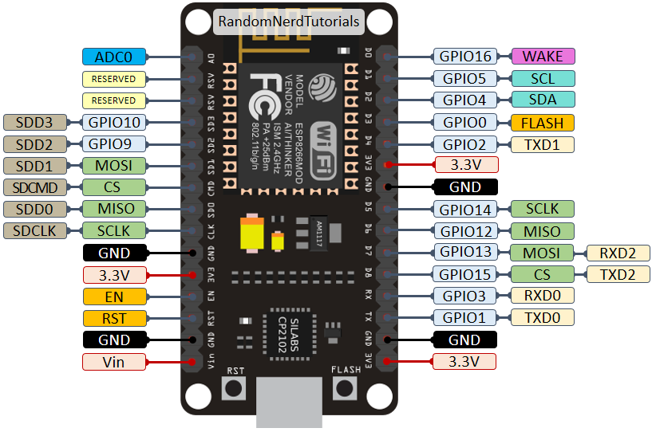
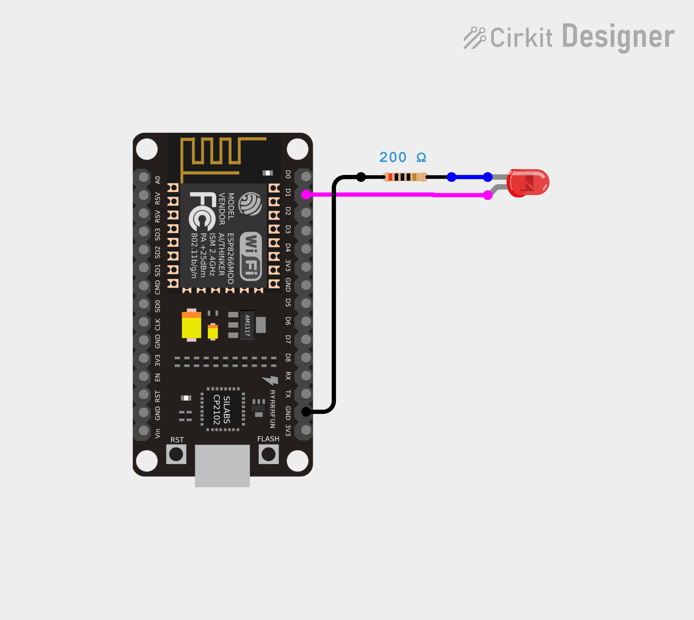
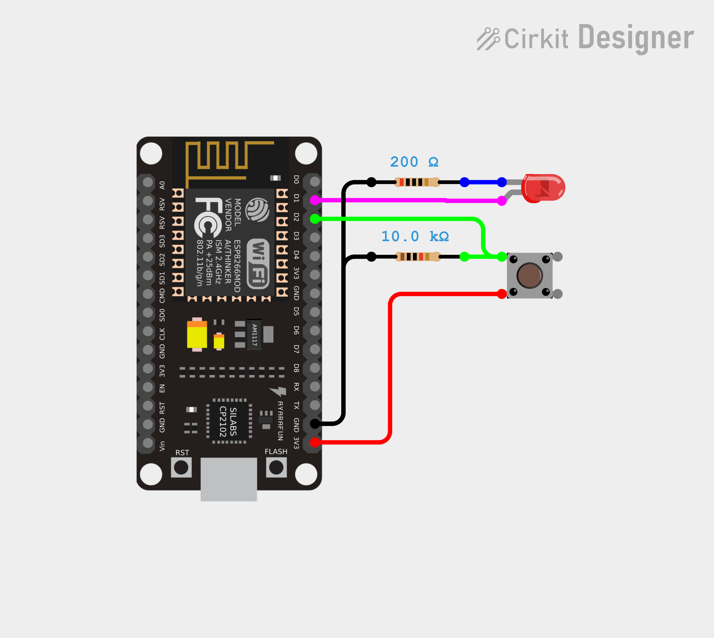

# **Praktikum 1: Fondasi Arsitektur Internet of Things (IoT) dan Mikrokontroler**

## **1.1 Pengantar**

Internet of Things (IoT) merupakan ekosistem di mana perangkat fisik terhubung ke jaringan internet untuk mengumpulkan dan bertukar data. Otak dari perangkat-perangkat ini adalah mikrokontroler. Pada Modul ini, kita akan mempelajari fondasi dasar arsitektur perangkat keras dan pemrograman mikrokontroler menggunakan **NodeMCU ESP8266**, sebuah *development board* yang menjadi standar populer di industri IoT. Mahasiswa akan diajak memahami arsitektur dasar, manajemen pin (GPIO), serta konsep pengendalian komponen elektronik sebagai *Input* dan *Output* secara digital.

## **1.2 Tujuan Pembelajaran**

* Mahasiswa mampu menginstal, mengonfigurasi, dan memprogram *board* NodeMCU ESP8266 menggunakan lingkungan Arduino IDE.
* Mahasiswa memahami pemetaan pin (*pinout*) NodeMCU, standar tegangan operasi 3.3V, dan perilaku khusus pin saat proses *booting*.
* Mahasiswa mampu merangkai dan memprogram operasi dasar *Digital Output* (mengendalikan LED) dan *Digital Input* (membaca status *push button* menggunakan rangkaian resistor *pull-down* eksternal).

## **1.3 Teori Dasar**

### **1.3.1 Pengenalan NodeMCU ESP8266**

ESP8266 merupakan *System on a Chip* (SoC) mikrokontroler berbiaya rendah yang dirancang oleh Espressif Systems. Fitur utamanya adalah kemampuannya menyediakan konektivitas Wi-Fi terintegrasi dan tumpukan (*stack*) protokol TCP/IP penuh, menjadikannya andalan utama untuk pembuatan perangkat *Internet of Things* (IoT).



**NodeMCU ESP8266 (ESP-12E/ESP-12F)** adalah papan pengembangan (*development board*) yang mempermudah penggunaan chip ESP8266. Papan ini mengintegrasikan regulator tegangan 3.3V dan chip USB-to-Serial (seperti CP2102 atau CH340). Hal ini memungkinkan *board* diprogram secara langsung melalui kabel USB tanpa memerlukan *programmer* eksternal tambahan.

### **1.3.2 Standar Tegangan Operasi 3.3V**

Berbeda dengan mikrokontroler tradisional (seperti Arduino Uno) yang menggunakan tegangan 5V, NodeMCU ESP8266 beroperasi penuh pada **tegangan 3.3V**. 
Perbedaan tegangan ini sangat penting karena menentukan bagaimana cip membaca dan mengirimkan sinyal digital (*logic level*):

* **Status HIGH (1):** Terjadi saat pin berada di tegangan 3.3V.
* **Status LOW (0):** Terjadi saat pin berada di tegangan 0V (GND).

> **[PERINGATAN!]:** Jangan pernah memberikan tegangan 5V secara langsung ke pin input ESP8266 (kecuali pin VIN). Pin GPIO ESP8266 tidak mentoleransi tegangan 5V (*not 5V tolerant*). Mengalirkan tegangan 5V ke pin I/O dapat merusak mikrokontroler secara permanen.

### **1.3.3 Pemetaan Pin (Pinout Reference)**

Kesalahan paling umum saat memprogram NodeMCU adalah asumsi penomoran pin. **Label *silkscreen* (tulisan fisik di papan)** seperti D1 dan D2, nilainya tidak sama dengan **nomor GPIO (General Purpose Input/Output)** pada struktur cip fisik yang harus dipanggil di dalam kode program.

Selain itu, beberapa pin terhubung secara internal ke cip *flash memory* sehingga tidak boleh digunakan (GPIO 6-11), dan beberapa pin memiliki perilaku khusus yang dapat menggagalkan proses *booting* jika diberi tegangan yang salah saat *board* dinyalakan.



Tabel berikut adalah referensi pin yang aman dan direkomendasikan untuk digunakan:

| Label | GPIO | Input | Output | Catatan |
| :--- | :--- | :--- | :--- | :--- |
| D0 | GPIO16 | Tanpa *interrupt* | Tanpa dukungan PWM atau I2C | HIGH saat *boot*<br>Digunakan untuk bangun dari *deep sleep* |
| D1 | GPIO5 | OK | OK | Sering digunakan sebagai SCL (I2C) |
| D2 | GPIO4 | OK | OK | Sering digunakan sebagai SDA (I2C) |
| D3 | GPIO0 | *Pulled up* | OK | Terhubung ke tombol FLASH, *boot* gagal jika ditarik LOW |
| D4 | GPIO2 | *Pulled up* | OK | HIGH saat *boot*<br>Terhubung ke LED *on-board*, *boot* gagal jika ditarik LOW |
| D5 | GPIO14 | OK | OK | SPI (SCLK) |
| D6 | GPIO12 | OK | OK | SPI (MISO) |
| D7 | GPIO13 | OK | OK | SPI (MOSI) |
| D8 | GPIO15 | *Pulled to GND* | OK | SPI (CS)<br>*Boot* gagal jika ditarik HIGH |
| RX | GPIO3 | OK | Pin RX | HIGH saat *boot* |
| TX | GPIO1 | Pin TX | OK | HIGH saat *boot*<br>*Output debug* saat *boot*, *boot* gagal jika ditarik LOW |
| A0 | ADC0 | Input Analog | X | - |

> **[TIP!]**: Selalu prioritaskan penggunaan **D1, D2, D5, D6, atau D7** untuk menyambungkan komponen eksternal guna menghindari masalah gagal *booting*.

### **1.3.4 Konsep Sinyal Digital dan Resistor *Pull-Down***

Dalam mikrokontroler, **Sinyal Digital** berarti pin hanya dapat membaca atau mengeluarkan dua keadaan mutlak: **HIGH (1)** atau **LOW (0)**.
- Sebagai **Output**, pin mengalirkan tegangan keluar (misalnya menyalakan LED).
- Sebagai **Input**, pin mendeteksi tegangan masuk dari luar (misalnya membaca apakah tombol ditekan).

**Masalah *Floating Pin***
Saat sebuah tombol tidak ditekan, pin input seringkali tidak terhubung ke sumber tegangan manapun. Kondisi ini disebut mengambang (*floating*), yang menyebabkan pin menangkap gangguan elektromagnetik sekitar dan menghasilkan nilai acak (bisa HIGH atau LOW tanpa alasan jelas).

**Solusi: Resistor *Pull-Down***
Untuk memberikan "kepastian" nilai, kita menggunakan resistor eksternal yang dihubungkan ke GND, yang disebut sebagai *pull-down* resistor (biasanya bernilai 10k Ohm).
- **Tombol TIDAK Ditekan:** Pin ditarik ke GND melalui resistor 10k Ohm. Status pasti terbaca = **LOW (0)**.
- **Tombol DITEKAN:** Arus 3.3V mengalir langsung ke pin mikrokontroler (karena hambatannya lebih kecil dari 10k Ohm). Status terbaca = **HIGH (1)**.

Konsep di mana "tombol ditekan menghasilkan nilai HIGH" ini dikenal dengan istilah logika **Aktif-Tinggi (*Active-High*)**.

## **1.4 Persiapan Praktikum**

### **1.4.1 Kebutuhan Perangkat Keras**

Pastikan komponen berikut tersedia dan siap digunakan:
1. *Board* NodeMCU ESP8266 (1 buah)
2. Kabel Data Micro USB (1 buah)
3. *Breadboard* / *Project Board* (1 buah)
4. LED 5mm (1 buah)
5. Resistor 220 Ohm (1 buah, sebagai pembatas arus LED)
6. Resistor 10k Ohm (1 buah, sebagai *pull-down* tombol)
7. *Tactile Push Button* / Sakelar Tekan (1 buah)
8. Kabel *Jumper* tipe *Male-to-Male* (secukupnya)

### **1.4.2 Konfigurasi Lingkungan Pengembangan (Arduino IDE)**

Sebelum memprogram, instal *board package* ESP8266 pada perangkat lunak Arduino IDE agar mikrokontroler dikenali.

1. Buka aplikasi **Arduino IDE**.
2. Buka menu **File > Preferences**.
3. Pada kolom **Additional Boards Manager URLs**, tempelkan tautan berikut:
   `http://arduino.esp8266.com/stable/package_esp8266com_index.json`
4. Buka menu **Tools > Board > Boards Manager...**
5. Ketik **"esp8266"** di kolom pencarian, kemudian klik **Install** pada paket `esp8266 by ESP8266 Community`. Tunggu hingga proses unduhan selesai.
6. Konfigurasi parameter *board* Anda pada menu **Tools**:
   - **Board:** Pilih `NodeMCU 1.0 (ESP-12E Module)`.
   - **Port:** Pilih *port COM* yang muncul saat NodeMCU dihubungkan ke laptop via USB.

## **1.5 Praktikum**

### **1.5.1 Praktikum 1: *Digital Output* (Menyalakan LED)**

Praktikum ini bertujuan memprogram NodeMCU agar mengalirkan tegangan 3.3V (HIGH) secara terprogram untuk menyalakan komponen eksternal.



**Langkah Kerja Rangkaian:**
1. Pasang NodeMCU pada *breadboard*.
2. Pasang LED pada baris kosong di *breadboard*. Perhatikan kakinya:
   - Kaki yang **lebih panjang** adalah **Anoda (Positif)**.
   - Kaki yang **lebih pendek** (dan terdapat sisi datar di tepi plastik kepala LED) adalah **Katoda (Negatif)**.
3. Hubungkan pin **D1 (GPIO 5)** dari NodeMCU ke kaki **Anoda** LED menggunakan kabel *jumper*.
4. Hubungkan kaki **Katoda** LED ke salah satu ujung **Resistor 220 Ohm**.
5. Hubungkan ujung **Resistor** lainnya ke jalur **GND** pada NodeMCU.
*(Catatan: Resistor berfungsi sebagai pembatas arus agar LED tidak terbakar).*

**Langkah Kerja Pemrograman:**
1. Buka Arduino IDE, klik **File > New Sketch**.
2. Tuliskan kode program berikut:

```cpp
const int ledPin = 5;

void setup() {
  Serial.begin(115200);
  pinMode(ledPin, OUTPUT);
  Serial.println("Praktikum 1 - Digital Output Dimulai!");
}

void loop() {
  digitalWrite(ledPin, HIGH);
  Serial.println("LED Menyala");
  delay(1000);
  
  digitalWrite(ledPin, LOW);
  Serial.println("LED Mati");
  delay(1000);
}
```

3. Klik tombol **Upload** (ikon panah ke kanan). Tunggu hingga muncul notifikasi *Done uploading*.
4. Buka **Serial Monitor** (ikon kaca pembesar di sudut kanan atas IDE).
5. Ubah pengaturan *baud rate* pada pojok kanan bawah Serial Monitor menjadi **115200 baud**.
6. Amati hasilnya: LED fisik berkedip setiap 1 detik selaras dengan teks status yang dicetak pada Serial Monitor.

**Penjelasan Singkat Kode:**
* `setup()`: Blok fungsi yang dieksekusi hanya **satu kali** saat NodeMCU dinyalakan atau di-*reset*. Biasanya digunakan untuk pengaturan awal.
* `loop()`: Blok fungsi yang dieksekusi secara **berulang-ulang** (terus menerus) selama NodeMCU memiliki daya.
* `pinMode(ledPin, OUTPUT)`: Memberi instruksi bahwa pin D1 (GPIO 5) akan digunakan sebagai jalur keluar (*Output*) tegangan.
* `digitalWrite(ledPin, HIGH)`: Memberikan tegangan 3.3V secara digital ke pin tersebut, sehingga arus mengalir dan LED menyala.
* `delay(1000)`: Menghentikan sementara eksekusi program (jeda) selama 1000 milidetik (1 detik).

### **1.5.2 Praktikum 2: *Digital Input* (Membaca *Push Button*)**

Praktikum ini bertujuan mendeteksi interaksi fisik dengan membaca status tegangan dari sebuah tombol, memanfaatkan rangkaian resistor *pull-down* eksternal.



**Langkah Kerja Rangkaian:**
1. Biarkan rangkaian LED pada pin **D1** dari Praktikum 1 tetap terpasang.
2. Pasang sebuah *push button* pada *breadboard*, melintasi garis pemisah/parit tengah.
3. Hubungkan **kaki pertama** *push button* ke pin **3V3** (3.3V) pada NodeMCU.
4. Hubungkan **kaki kedua** *push button* ke pin **D2 (GPIO 4)** NodeMCU.
5. Pada **kaki kedua** yang sama, pasang sebuah **Resistor 10k Ohm**, lalu hubungkan ujung lain dari resistor tersebut ke jalur **GND** NodeMCU.

**Langkah Kerja Pemrograman:**
1. Buat berkas baru (*New Sketch*) pada Arduino IDE.
2. Tuliskan kode program berikut:

```cpp
const int buttonPin = 4;
const int ledPin = 5;

int buttonState = 0;

void setup() {
  Serial.begin(115200);
  pinMode(buttonPin, INPUT);
  pinMode(ledPin, OUTPUT);
}

void loop() {
  buttonState = digitalRead(buttonPin);
  
  if (buttonState == HIGH) {
    digitalWrite(ledPin, HIGH);
    Serial.println("Tombol ditekan! -> LED ON");
  } else {
    digitalWrite(ledPin, LOW);
  }
}
```

3. **Upload** program ke dalam mikrokontroler.
4. Buka **Serial Monitor**.
5. Uji fungsionalitasnya: Saat tombol ditekan dan ditahan, LED akan menyala terang. Saat tombol dilepaskan, LED langsung padam.

**Penjelasan Singkat Kode:**
* `pinMode(buttonPin, INPUT)`: Menetapkan pin D2 (GPIO 4) sebagai jalur masuk (*Input*) untuk mendeteksi / membaca tegangan dari luar.
* `digitalRead(buttonPin)`: Fungsi yang bertugas membaca status tegangan pada pin saat ini. Hasilnya akan berupa `HIGH` (ada tegangan) atau `LOW` (tidak ada tegangan).
* `if (buttonState == HIGH)`: Blok logika *conditional*. Karena kita menggunakan rangkaian resistor *pull-down*, menekan tombol akan mengalirkan arus 3.3V ke pin mikrokontroler. Sehingga, status terbaca `HIGH` dan kondisi `if` terpenuhi (LED dinyalakan).

## **1.6 Latihan**

Kerjakan latihan berikut untuk menguji pemahaman Anda. Jelaskan hasilnya di dalam laporan!

*   **Latihan 1 (Pemahaman Logika Pin):** Berdasarkan tabel Referensi Pinout di subbab 1.3.3, jelaskan apa yang mungkin terjadi jika Anda menggunakan logika rangkaian dari Praktikum 2 (Active-High / *pull-down*), namun menyambungkan tombol tersebut ke pin **D8 (GPIO 15)**, lalu menekan tombol tersebut *tepat* pada detik di mana NodeMCU baru diberi daya?
*   **Latihan 2 (Implementasi Kode):** Modifikasi kode pada Praktikum 1 agar LED berkedip secara *tidak simetris*, yaitu menyala sangat cepat selama 200 ms, kemudian mati agak lama selama 800 ms. Tuliskan dua baris fungsi `delay()` yang harus Anda ubah.
*   **Latihan 3 (Analisis Sirkuit):** Berdasarkan hukum aliran arus listrik searah, apa yang terjadi jika pada Praktikum 1 Anda memasang kaki LED secara terbalik (Anoda ke GND, Katoda ke D1)? Apakah program akan mengalami *error* kompilasi? Mengapa LED tidak menyala?
*   **Latihan 4 (Pengembangan Algoritma):** Ubah blok kondisi `if-else` pada Praktikum 2 sehingga perilakunya terbalik: "Saat tombol TIDAK ditekan, LED **menyala**. Saat tombol DITEKAN, LED justru **mati**."

## **1.7 Tugas**

Tugas ini harus dikerjakan secara mandiri untuk mengukur kemampuan integrasi dan logika pemrograman Anda.

**Modifikasi Sistem Sakelar *Toggle* (*Latching*)**
*   **Tujuan:** Mampu mengimplementasikan logika pelacakan status (*state tracking*) dan membedakan antara perilaku tombol *momentary* dengan *latching*.
*   **Tingkat Kesulitan:** Menengah
*   **Instruksi:**
    1. Gunakan konfigurasi *hardware* yang persis sama dengan Praktikum 2 (Rangkaian *Pull-Down*).
    2. Modifikasi kode program sehingga tombol berfungsi layaknya sakelar lampu ruangan:
       - Saat sistem pertama dinyalakan, LED dalam keadaan mati.
       - Jika tombol ditekan 1 kali *lalu dilepas*, LED **menyala dan tetap menyala**.
       - Jika tombol ditekan 1 kali lagi *lalu dilepas*, LED **mati dan tetap mati**.
    3. *Petunjuk:* Gunakan variabel penyimpanan status (misalnya tipe `boolean` atau `int`) untuk melacak apakah lampu saat ini sedang ON atau OFF. Anda juga membutuhkan instruksi `delay()` singkat (sekitar 200 milidetik) tepat setelah mendeteksi tombol ditekan, untuk mengatasi fenomena pantulan mekanis (*debouncing* pada tombol fisik).
*   **Kriteria Keberhasilan:**
    - Perubahan status (ON ke OFF, atau sebaliknya) hanya terjadi dengan *satu kali tekanan singkat* (bukan ditahan).
    - Tidak ada fenomena *flickering* (lampu berkedip acak atau gagal mati) saat tombol ditekan.
    - Program memiliki baris komentar yang menjelaskan bagaimana logika pelacakan *state* dan *debounce* bekerja.

> **[PENTING!]**
> **Instruksi Pengumpulan Tugas Praktikum**
> Seluruh pengerjaan praktikum dan tugas (meliputi *source code* berformat `.ino`, dokumentasi foto/video sirkuit yang berhasil, tangkapan layar *Serial Monitor*, serta laporan praktikum tertulis .PDF) harus dikumpulkan dengan cara melakukan **commit dan push ke repositori GitHub pribadi Anda masing-masing**.
> 
> Tautkan/kumpulkan *URL repositori GitHub* Anda pada sistem manajemen pembelajaran (LMS) kampus sebagai bukti penyelesaian praktikum ini.

## **1.8 Rangkuman**

Pada Modul ini, kita telah meletakkan fondasi pemrograman *Internet of Things* (IoT) menggunakan NodeMCU ESP8266. Pemahaman terhadap standar tegangan operasi (3.3V) dan pemetaan khusus pada *pinout* (seperti D1 dan D2 yang terhubung ke GPIO 5 dan 4) merupakan prasyarat mutlak untuk mencegah kegagalan operasi. Dengan menguasai konsep dasar *Digital Output* melalui pengendalian LED dan konsep *Digital Input* menggunakan rangkaian resistor *Pull-Down* pada sakelar, mahasiswa telah memiliki batu loncatan yang esensial untuk mengintegrasikan berbagai jenis sensor dan aktuator digital tingkat lanjut yang akan dipelajari pada praktikum berikutnya.
