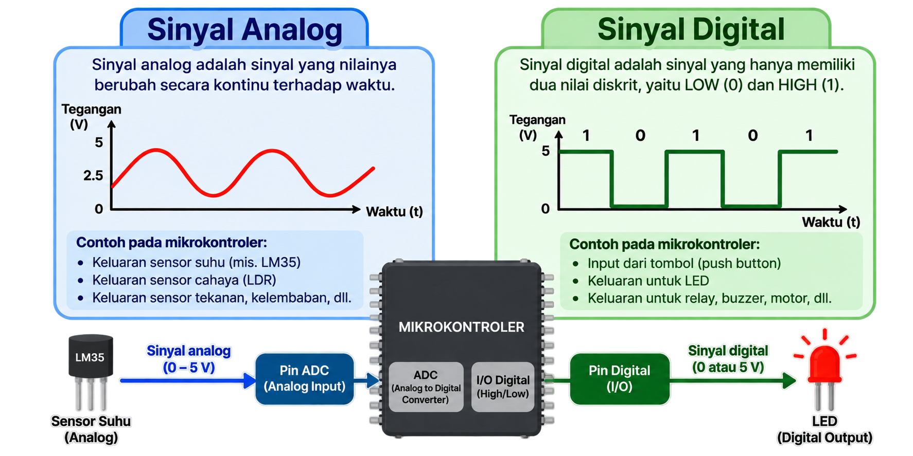
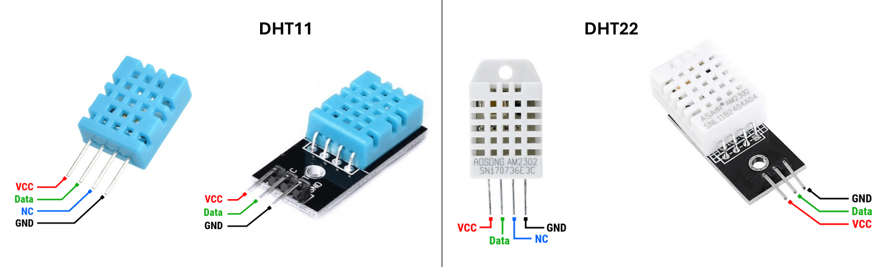
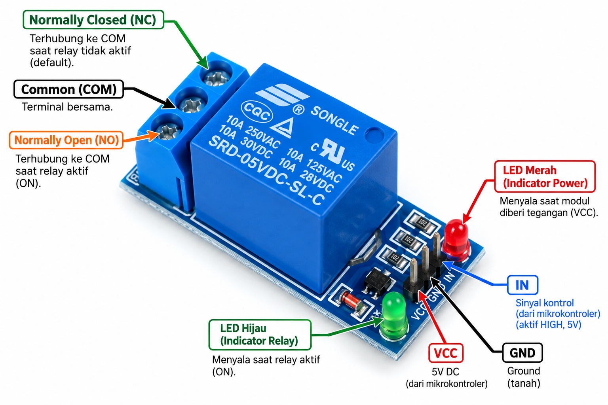
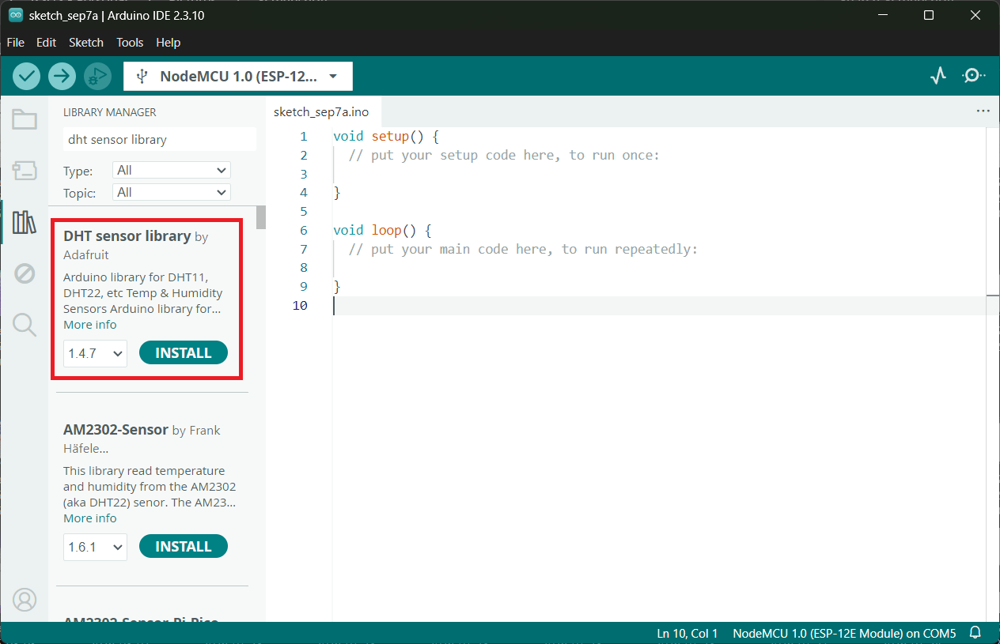
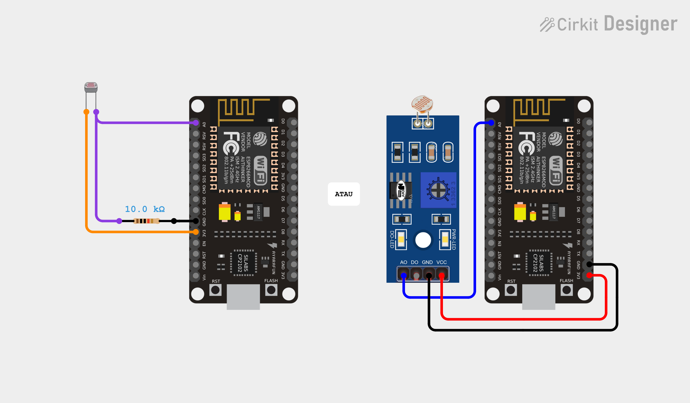
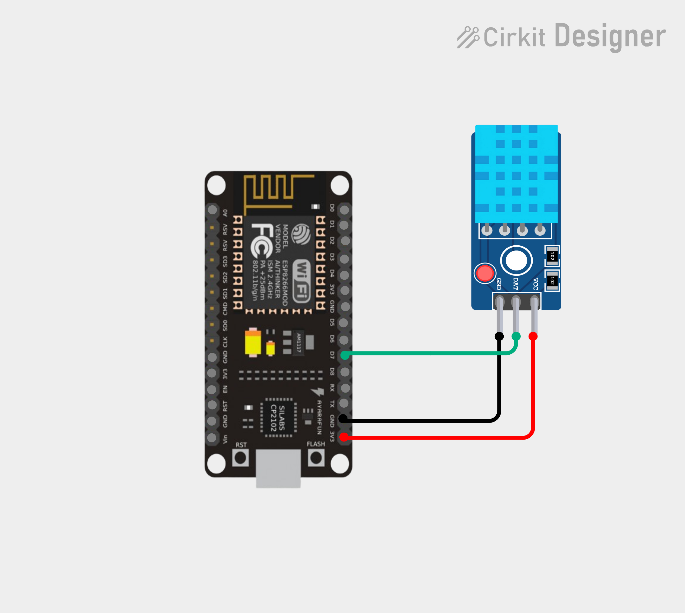

# **Praktikum 2: Antarmuka Sensor dan Sistem Kendali Dasar**

## **2.1 Pengantar**

Setelah memahami dasar pengendalian sinyal digital (Input/Output) pada Modul 1, kita akan melangkah ke tahap selanjutnya: bagaimana mikrokontroler berinteraksi dengan lingkungan sekitarnya secara lebih kompleks. Pada Modul ini, mahasiswa akan diperkenalkan pada metode membaca sinyal analog yang bernilai kontinu (seperti perubahan intensitas cahaya pada LDR), membaca protokol sensor digital (DHT), serta bagaimana menggunakan modul *Relay* untuk mengendalikan aktuator berdaya tinggi dengan aman. Kombinasi dari kemampuan ini adalah fondasi utama dalam menciptakan mesin otomasi atau *rule engine* cerdas pada sistem *Internet of Things*.

## **2.2 Tujuan Pembelajaran**

* Mahasiswa mampu menjelaskan perbedaan karakteristik akuisisi sinyal analog dan sinyal digital pada mikrokontroler.  
* Mahasiswa mampu membaca sinyal analog melalui pin ADC A0 menggunakan prinsip sirkuit pembagi tegangan (*voltage divider*).  
* Mahasiswa mampu menginstal *library* pihak ketiga dan membaca data telemetri dari sensor digital *single-bus* (DHT11/DHT22).  
* Mahasiswa mampu merangkai dan memprogram modul *Relay* (terisolasi *optocoupler*) untuk mengendalikan beban aktuator.  
* Mahasiswa mampu membuat sistem kendali otomasi lokal berdasar ambang batas (*threshold*) dari pembacaan multi-sensor.

## **2.3 Teori Dasar**

### **2.3.1 Sinyal Analog vs Sinyal Digital**

Sinyal kelistrikan yang dibaca oleh pin input ESP8266 terbagi menjadi dua kategori utama:

1. **Sinyal Digital:** Hanya memiliki dua kondisi pasti, yaitu HIGH (1 / tegangan mendekati 3.3V) dan LOW (0 / tegangan mendekati 0V). Contoh komponen: *Push Button*, Sensor PIR, Sensor Jangkauan Ultrasonik.  
2. **Sinyal Analog:** Memiliki nilai kontinu (berubah-ubah perlahan) dalam suatu rentang tegangan. Contoh komponen: *Light Dependent Resistor* (LDR), Potensiometer, Sensor Kelembapan Tanah (*Soil Moisture*) analog.



### **2.3.2 *Analog-to-Digital Converter* (ADC) pada ESP8266**

Pin GPIO standar tidak bisa membaca sinyal analog secara langsung. Oleh karena itu, mikrokontroler dilengkapi dengan fitur **Analog-to-Digital Converter (ADC)**. ADC berfungsi mengonversi level tegangan analog murni menjadi angka digital (*integer*) yang bisa diolah oleh program.

> **Spesifikasi Kritis NodeMCU ESP8266:**
* Hanya memiliki **satu buah** pin ADC, yaitu pin **A0 (TOUT)**.  
* Resolusi ADC adalah **10-bit**, yang artinya rentang nilai konversinya terbentang dari **0 hingga 1023**.  
* Batas maksimum tegangan input pada *chip* murni ESP8266 adalah **1.0V**. Namun, pada *board* NodeMCU yang umum beredar, sudah disematkan resistor pembagi tegangan internal sehingga rentang input yang aman pada pin A0 menjadi **0V hingga 3.3V**.

### **2.3.3 Sensor Digital DHT11/DHT22**

DHT11 dan DHT22 adalah sensor lingkungan populer yang mengukur Suhu (*Temperature*) dan Kelembapan Relatif (*Relative Humidity*). Keduanya berisi sebuah sensor kelembapan tipe kapasitif, termistor pengukur suhu, dan sebuah cip mikrokontroler internal.



Alih-alih mengirimkan sinyal analog, cip internal tersebut mengonversi nilai suhu dan kelembapan, lalu memancarkannya sebagai deretan data digital melalui **satu kabel data (One-Wire/Single-Bus protocol)**.

| Fitur | DHT11 (Casing Biru) | DHT22 (Casing Putih) |
| :--- | :--- | :--- |
| **Rentang Suhu** | 0 Celcius hingga 50 Celcius | -40 Celcius hingga 80 Celcius |
| **Rentang Kelembapan** | 20% hingga 90% RH | 0% hingga 100% RH |
| **Frekuensi Pembacaan** | Maksimal 1 kali per detik (1 Hz) | Maksimal 1 kali per 2 detik (0.5 Hz) |

### **2.3.4 *Relay Module* dan *Optocoupler***

*Relay* adalah sakelar elektromekanis. Ia menggunakan arus searah (DC) bervoltase rendah (misal: sinyal 3.3V dari ESP8266) untuk menghidupkan kumparan elektromagnetik. Daya magnet ini menarik tuas jangkar yang akan menyambung atau memutus sirkuit tegangan/arus tinggi (seperti listrik PLN 220V AC).



Modul *relay* yang digunakan dalam praktikum umumnya memiliki cip **Optocoupler**. Cip ini bertugas memisahkan / mengisolasi sirkuit tegangan rendah (NodeMCU) dari tegangan tinggi secara optik (menggunakan cahaya inframerah internal). Isolasi optik ini sangat penting untuk mencegah *spike* (lonjakan arus balik) yang bisa merusak mikrokontroler.

## **2.4 Persiapan Praktikum**

### **2.4.1 Kebutuhan Perangkat Keras**

Pastikan komponen berikut tersedia di meja Anda:
* *Board* NodeMCU ESP8266 (1 buah)  
* Kabel Micro USB (1 buah)  
* *Breadboard* (1 buah)  
* Sensor LDR (1 buah)  
* Resistor 10k Ohm (1 buah, untuk pembagi tegangan LDR)  
* Sensor Suhu & Kelembapan (DHT11 atau DHT22) (1 buah)  
* Modul Relay 1-Channel 5V (1 buah)  
* LED 5mm (1 buah)  
* Resistor 220 Ohm (1 buah, untuk pembatas arus LED)  
* Kabel *Jumper Male-to-Male* dan *Male-to-Female* (secukupnya)

### **2.4.2 Persiapan Perangkat Lunak (Instalasi *Library* DHT)**

Membaca sinyal digital *single-bus* dari sensor DHT sangat rumit jika dilakukan manual karena membutuhkan presisi waktu dalam hitungan *microsecond*. Oleh karena itu, kita wajib menginstal perangkat lunak tambahan berupa *Library*.

1. Pada Arduino IDE, buka menu **Sketch > Include Library > Manage Libraries...**
2. Ketikkan kata kunci **"DHT sensor library"** di kotak pencarian.
3. Cari pustaka yang dibuat secara resmi oleh **Adafruit** dan klik **Install**.



4. *(Penting)* Jika muncul dialog persetujuan (*prompts*) untuk menginstal pustaka dependen/tambahan, pastikan Anda menekan tombol **"Install All"**. (Library ini membutuhkan *Adafruit Unified Sensor* agar dapat beroperasi).

## **2.5 Praktikum**

### **2.5.1 Praktikum 1: Pembacaan Intensitas Cahaya (LDR) via ADC**

Sensor LDR akan menurunkan hambatannya (resistansi) saat terpapar cahaya terang, dan meningkatkan resistansinya saat gelap. Untuk menerjemahkan perubahan resistansi ini menjadi variasi tegangan yang bisa diukur oleh pin A0, kita menggunakan sirkuit pembagi tegangan (*Voltage Divider*).



**Langkah Kerja Rangkaian:**
1. Tancapkan satu kaki LDR ke lubang *breadboard* yang terhubung langsung ke pin **3V3** (3.3 Volt) NodeMCU.  
2. Tancapkan kaki LDR yang satunya ke sebuah jalur parit kosong di *breadboard*.  
3. Hubungkan parit LDR tersebut dengan pin **A0** menggunakan sebuah kabel *jumper*.  
4. Pada parit LDR yang sama (sejajar dengan kabel ke A0), pasang salah satu kaki **Resistor 10k Ohm**.
5. Hubungkan ujung hulu Resistor 10k Ohm tersebut ke rel **GND**.

*(Logika Rangkaian: Saat cahaya terang, resistansi LDR kecil sehingga arus 3.3V membanjiri A0, menghasilkan nilai ADC besar mendekati 1023. Saat gelap, resistansi LDR sangat besar menahan arus, sehingga pin A0 'tertarik' oleh resistor 10k ke arah GND, menghasilkan nilai ADC kecil mendekati 0).*

**Langkah Kerja Pemrograman:**
1. Buat berkas baru (*New Sketch*).
2. Tuliskan kode program berikut:

```cpp
const byte ldrPin = A0; 

void setup() {  
  Serial.begin(115200);  
}

void loop() {  
  int ldrValue = analogRead(ldrPin);   
    
  Serial.print("Intensitas Cahaya (ADC): ");  
  Serial.println(ldrValue);  
    
  delay(1000);   
}
```

3. **Upload** program. Buka **Serial Monitor** (pastikan setelan 115200 baud).
4. **Instruksi Pengujian:** Sorot LDR dengan lampu *flash* ponsel dan amati angka yang membesar. Lalu, tutup bagian atas LDR rapat-rapat dengan jari dan amati penurunannya.

**Penjelasan Singkat Kode:**
* `const byte ldrPin = A0;`: Mendeklarasikan pin ADC. Tipe `byte` digunakan (menggantikan `int`) untuk menghemat memori (*RAM*), karena ID pin tidak akan melebihi angka 255.
* `analogRead(ldrPin);`: Fungsi bawaan mikrokontroler untuk membaca level tegangan analog murni di pin A0 dan mengonversinya menjadi data integer 10-bit (berkisar antara 0 hingga 1023).

### **2.5.2 Praktikum 2: Membaca Data Sensor Suhu & Kelembapan (DHT)**

Sensor DHT menggunakan protokol komunikasi digital *single-wire*. Artinya, seluruh data (suhu dan kelembapan) ditransmisikan melalui satu kabel data saja. Protokol ini sangat bergantung pada waktu (*timing*). Mikrokontroler harus mengirimkan perintah "minta data" dengan durasi *HIGH* dan *LOW* yang sangat presisi. Setelah itu, sensor akan mengirimkan kembali serangkaian pulsa digital yang panjangnya spesifik menunjukkan nilai suhu dan kelembapan.



**Langkah Kerja Rangkaian:**
1. Hubungkan pin **VCC / + / 3V3** pada DHT ke pin **3V3** NodeMCU.  
2. Hubungkan pin **GND / -** pada DHT ke pin **GND** NodeMCU.  
3. Hubungkan pin **DATA / OUT / S** pada DHT ke pin **D7 (GPIO 13)** pada NodeMCU.

**Langkah Kerja Pemrograman:**
1. Buat berkas baru (*New Sketch*).
2. Tuliskan kode program berikut:

```cpp
#include <DHT.h> 

const byte dhtPin = 13;       
#define DHTTYPE DHT11        

DHT dht(dhtPin, DHTTYPE); 

void setup() {  
  Serial.begin(115200);  
  dht.begin();   
  Serial.println("Memulai Sensor Lingkungan...");  
}

void loop() {  
  delay(2500); 

  float temp = dht.readTemperature();   
  float hum = dht.readHumidity();     

  if (isnan(temp) || isnan(hum)) {  
    Serial.println("Gagal membaca data dari sensor DHT!");  
    return; 
  }

  Serial.print("Suhu: ");  
  Serial.print(temp);  
  Serial.print(" Celcius | Kelembapan: ");  
  Serial.print(hum);  
  Serial.println(" %");  
}
```

3. **Upload** program dan buka **Serial Monitor**. Anda akan melihat data suhu lingkungan dan persentase kelembapan udara dicetak setiap 2.5 detik.

**Penjelasan Singkat Kode:**
* `#include <DHT.h>`: Mengimpor fungsi-fungsi dari *library* Adafruit DHT yang baru saja Anda instal.
* `#define DHTTYPE DHT11`: Mendefinisikan konstanta preprosesor untuk tipe sensor. (Ubah menjadi `DHT22` jika sensor Anda berwarna putih).
* `DHT dht(dhtPin, DHTTYPE);`: Membentuk "objek" pengendali bernama `dht` yang mengingat pin data dan jenis sensor yang digunakan.
* `float temp = dht.readTemperature();`: Perintah ini bertugas membaca suhu dan menyimpannya dalam variabel `float` (karena mengandung angka desimal).
* `isnan(temp)`: *Is Not a Number*. Fungsi matematika yang bertindak sebagai sistem perlindungan (*error handling*). Jika kabel sensor putus, *library* akan menghasilkan data rusak (Not-A-Number). Blok `if` ini bertugas mendeteksi kerusakan tersebut dan membatalkan sisa kode di bawahnya dengan perintah `return;`.

## **2.6 Latihan**

Kerjakan latihan berikut untuk menguji retensi konsep Anda secara mandiri.

*   **Latihan 1 (Pemahaman Sistem ADC):** Mengapa batas maksimal nilai intensitas cahaya yang terbaca pada Serial Monitor di Praktikum 1 adalah sekitar angka 1023 (bukan 100 atau 1000)? Kaitkan jawaban Anda dengan penjelasan "Resolusi ADC 10-bit".
*   **Latihan 2 (Implementasi Algoritma):** Nilai ADC 0-1023 tidak lazim dibaca oleh pengguna akhir (manusia). Modifikasi kode pada Praktikum 1 agar program menghitung dan mencetak persentase intensitas cahaya (rentang 0% hingga 100%). Tuliskan rumus matematika / perintah pembagian yang Anda sematkan di kode tersebut!
*   **Latihan 3 (Analisis Rangkaian):** Di subbab 2.3.4 disebutkan sifat modul *Relay* yang terisolasi *Optocoupler*. Banyak *Relay* di pasaran yang bekerja secara **Active-Low**. Jika *Relay* Anda bertipe *Active-Low*, apa yang terjadi pada aktuator (misal: lampu ruangan) yang terhubung ke *Relay* jika program Anda mengeksekusi `digitalWrite(relayPin, HIGH)`?
*   **Latihan 4 (Pengembangan Logika):** Gabungkan wawasan dari Praktikum 1 Modul 2 ini dengan logika kendali LED dari Praktikum Modul 1. Gunakan blok kondisional `if` yang berfungsi menyalakan sebuah LED (D1) **HANYA JIKA** sensor LDR mendeteksi lingkungan yang gelap gulita (misalnya: ambang batas ADC berada di bawah angka 200).

## **2.7 Tugas: Sistem Otomasi Kontrol Lokal Terpadu**

Sebuah sistem *Internet of Things (IoT)* harus memiliki kecerdasan dasar pada perangkat lapangannya (*Edge Computing*), sehingga apabila sewaktu-waktu koneksi internet terputus, perangkat masih dapat mengambil keputusan darurat berdasarkan kondisi lingkungan lokalnya.

**Skenario Proyek (*Smart Warehouse*):**
Anda ditugaskan merancang *rule engine* aktuator mandiri. Sistem harus membaca Suhu (DHT) dan Intensitas Cahaya (LDR) secara bersamaan. Modul **Relay 5V** akan disimulasikan sebagai sakelar daya untuk pendingin ruangan (*Exhaust Fan*) atau sistem pencahayaan darurat.

*   **Tujuan:** Mampu memadukan akuisisi multi-sensor (Analog LDR dan Digital DHT) dan menggunakan aktuator Relay untuk mengeksekusi keputusan terpadu berbasis kondisi/ambang batas.
*   **Tingkat Kesulitan:** Menengah-Lanjut
*   **Instruksi Perangkaian:**
    1. Pertahankan sirkuit sensor LDR (di A0) dan DHT (di D7).  
    2. Hubungkan pin **VCC / +5V** dari Modul Relay ke pin **VIN** atau **VU** NodeMCU (mengambil daya murni 5V dari USB). **Jangan menyambungkan modul Relay 5V ke pin 3V3!**
    3. Hubungkan pin **GND** Relay ke jalur **GND** bersama NodeMCU.  
    4. Hubungkan pin **IN / Signal** Relay ke pin **D6 (GPIO 12)**.  
    5. *(Opsional sebagai indikator visual tambahan)*: Pasang sebuah LED beresistor 220 Ohm pada pin **D1 (GPIO 5)**.

*   **Instruksi Pemrograman (Aturan/Rule Engine):**
    1. Konfigurasikan pin Relay (D6) dan LED (D1) sebagai `OUTPUT`. (Kirimkan perintah mati di awal fungsi `setup()` untuk keamanan).
    2. Buatlah struktur logika perbandingan (`if ... else`) menggunakan operator logika **OR (`||`)**.
    3. **Aktifkan Relay** dan **nyalakan LED indikator** JIKA kondisi lingkungan buruk berikut terpenuhi:
       - Suhu udara terbaca **di atas 34 Celcius** (Terlalu panas).
       - ATAU Nilai ADC LDR terbaca **di bawah angka 300** (Terlalu gelap).
    4. Jika suhu normal dan ruangan cukup cahaya, pastikan Relay dan LED kembali mati.
    5. Cetak status sistem ke Serial Monitor secara rutin (Contoh: "Kondisi Aman" / "Peringatan: Aktuator Aktif!").

*   **Kriteria Keberhasilan:**
    - Sensor LDR dan DHT berhasil dibaca bersamaan dalam satu *loop* tanpa interupsi atau kegagalan pembacaan (*NaN*).
    - Logika kondisi OR beroperasi dengan presisi (cukup salah satu syarat buruk terpenuhi, aktuator menyala).
    - Relay bekerja selaras dan logis sesuai dengan sifat modul kelistrikan tersebut (pahami apakah modul Anda bersifat *Active-Low* atau *Active-High*).

> **[PENTING!]**
> **Instruksi Pengumpulan Tugas Praktikum**
> Seluruh pengerjaan praktikum dan tugas (meliputi *source code* berformat `.ino`, dokumentasi foto/video sirkuit dan aktivasi *Relay* yang berhasil, tangkapan layar *Serial Monitor*, serta laporan praktikum tertulis) harus dikumpulkan dengan cara melakukan **commit dan push ke repositori GitHub pribadi Anda masing-masing**.
> 
> Tautkan/kumpulkan *URL repositori GitHub* Anda pada sistem manajemen pembelajaran (LMS) kampus sebagai bukti penyelesaian bab ini.

## **2.8 Rangkuman**

Pada Modul ini, kita telah mempelajari tiga instrumen penting penyusun arsitektur IoT di ranah perangkat keras lokal (*Edge*). Kita berhasil menelaah fenomena sinyal analog dari sensor alamiah (LDR) dan mengonversinya menjadi data numerik bermakna 10-bit menggunakan fitur internal *Analog-to-Digital Converter (ADC)*. Kita juga membedahnya dengan sensor digital terpadu (DHT) yang mengemas pengukuran menjadi data matang melalui transmisi satu kabel yang harus diproses melalui bantuan *Library*. Pada akhirnya, wawasan tentang pemisahan beban daya listrik melalui *Relay Optocoupler* telah melengkapi keterampilan esensial kita dalam menghubungkan "otak" sistem berdaya rendah 3.3V dengan peralatan mekanis dunia nyata yang menuntut voltase tinggi.